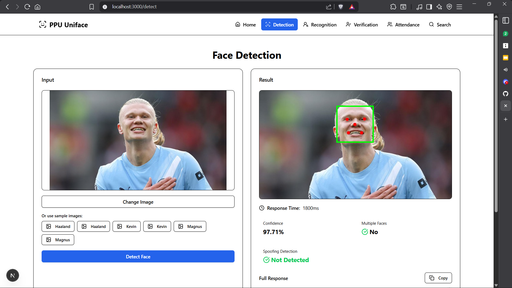

# PPU Uniface Demo [SERVER-SIDE]



A comprehensive Next.js web application demonstrating the capabilities of [ppu-uniface](https://github.com/PT-Perkasa-Pilar-Utama/ppu-uniface), a powerful TypeScript library for face detection, recognition, verification, and anti-spoofing.


> **⚠️ Deployment Note**: This application uses native Node.js modules (`onnxruntime-node`) and requires a containerized environment. It **cannot** be deployed to Vercel's serverless platform. Use Docker-based platforms like Railway, Render, or Fly.io instead.

> [!WARNING]  
> First detection might takes time to download the onnx model

## 🎯 Features

This demo showcases all major features of ppu-uniface through an intuitive web interface:

### 1. **Face Detection**
- Real-time face detection with bounding boxes
- 5-point facial landmark detection
- Confidence scoring
- Multiple face detection
- Anti-spoofing detection
- Performance metrics (response time)

### 2. **Face Recognition**
- Generate 512-dimensional face embeddings
- FaceNet512 model integration
- Copy embeddings to clipboard
- Visual embedding preview

### 3. **Face Verification**
- Compare two face images
- Similarity score calculation
- Configurable threshold
- Multiple face detection warnings
- Webcam capture support

### 4. **Attendance Simulation**
- Live webcam-based attendance system
- Real-time face matching
- Configurable similarity threshold (50-95%)
- Adjustable check frequency (0.2-2 FPS)
- Visual success indicators

### 5. **Face Search & Database**
- SQLite database for face storage
- Add faces with names
- Search faces by similarity
- Match percentage display
- Database management interface

## 🚀 Getting Started

### Prerequisites

- [Bun](https://bun.sh/) v1.3.1 or higher
- Node.js v18+ (for compatibility)

### Installation

```bash
# Clone the repository
git clone <your-repo-url>
cd ppu-uniface-demo

# Install dependencies
bun install

# Run database migrations
bun run db:push

# Start development server
bun run dev
```

Open [http://localhost:3000](http://localhost:3000) to view the application.

### Build for Production

```bash
# Create optimized production build
bun run build

# Start production server
bun run start
```

## 🛠️ Technology Stack

- **Framework**: Next.js 16.0.5 (App Router)
- **Runtime**: Bun 1.3.1
- **Language**: TypeScript
- **Styling**: Tailwind CSS v4
- **UI Components**: shadcn/ui (New York style)
- **Database**: SQLite with Drizzle ORM
- **Face Processing**: [ppu-uniface](https://github.com/PT-Perkasa-Pilar-Utama/ppu-uniface) v1.1.0
- **Webcam**: react-webcam v7.2.0

## 📁 Project Structure

```
ppu-uniface-demo/
├── app/                      # Next.js app directory
│   ├── api/                  # API routes
│   │   ├── detect/          # Face detection endpoint
│   │   ├── recognize/       # Face recognition endpoint
│   │   ├── verify/          # Face verification endpoint
│   │   ├── faces/           # Face database CRUD
│   │   └── search/          # Face search endpoint
│   ├── detect/              # Detection page
│   ├── recognize/           # Recognition page
│   ├── verify/              # Verification page
│   ├── attendance/          # Attendance simulation page
│   ├── search/              # Face search page
│   └── globals.css          # Global styles
├── components/              # Reusable components
│   ├── ui/                  # shadcn/ui components
│   ├── file-drop-zone.tsx   # Drag-and-drop upload
│   ├── copy-button.tsx      # Copy to clipboard
│   ├── sample-selector.tsx  # Sample image selector
│   ├── webcam-capture.tsx   # Webcam capture modal
│   └── navigation.tsx       # Navigation bar
├── lib/                     # Utilities and configurations
│   ├── db/                  # Database setup
│   │   ├── schema.ts        # Drizzle schema
│   │   └── index.ts         # Database connection
│   └── uniface.ts           # Uniface singleton
├── public/
│   └── sample/              # Sample face images
└── drizzle.config.ts        # Drizzle ORM config
```

## 🎨 UI/UX Features

### Global Enhancements
- **Drag & Drop Upload**: All pages support drag-and-drop file uploads
- **Sample Images**: Quick access to pre-loaded sample images
- **Copy Buttons**: One-click copy for JSON results and embeddings
- **Webcam Capture**: Live camera capture for verification and attendance
- **Response Time Tracking**: Performance metrics for all operations
- **Fixed Image Heights**: Consistent 300px preview containers
- **Responsive Design**: Mobile-first approach with adaptive layouts

### Interactive Elements
- Vibrant blue primary color scheme
- Hover effects on all interactive elements
- Loading states with spinners
- Success/error visual feedback
- Configurable sliders with real-time updates

## 📊 Database Schema

```typescript
faces {
  id: integer (auto-increment, primary key)
  name: text (not null)
  embedding: text (JSON stringified Float32Array)
  createdAt: timestamp (default: now)
}
```

## 🔧 Configuration

### Environment Variables

No environment variables required for basic setup. The application uses SQLite with local file storage.

### Next.js Configuration

The project is configured to handle native Node.js modules:

```typescript
serverExternalPackages: ["@napi-rs/canvas", "onnxruntime-node"]
```

## 📝 API Routes

| Endpoint | Method | Description |
|----------|--------|-------------|
| `/api/detect` | POST | Detect faces in an image |
| `/api/recognize` | POST | Generate face embedding |
| `/api/verify` | POST | Compare two faces |
| `/api/faces` | GET | List all stored faces |
| `/api/faces` | POST | Add new face to database |
| `/api/search` | POST | Search for matching faces |

## 🧪 Sample Images

The project includes sample images in `public/sample/`:
- Haaland (2 images)
- Kevin (2 images)
- Magnus (2 images)
- Multiple faces (1 image)

## 🎯 Use Cases

This demo is perfect for:
- Understanding ppu-uniface capabilities
- Prototyping face recognition systems
- Building attendance systems
- Implementing access control
- Creating face-based search engines
- Learning face detection/recognition concepts

## � Deployment

### Why Not Vercel?

This application uses `onnxruntime-node`, which requires native binaries (`libonnxruntime.so`) that are not available in Vercel's serverless environment. Additionally, the ONNX models are downloaded and cached on first run, which doesn't work well with ephemeral serverless functions.

### Recommended Platforms

Deploy to any Docker-based platform:

#### Option 1: Railway (Easiest)
1. Push your code to GitHub
2. Go to [Railway](https://railway.app/)
3. Click "New Project" → "Deploy from GitHub repo"
4. Select your repository
5. Railway will automatically detect the Dockerfile and deploy

#### Option 2: Render
1. Push your code to GitHub
2. Go to [Render](https://render.com/)
3. Click "New" → "Web Service"
4. Connect your repository
5. Render will use the `render.yaml` configuration

#### Option 3: Fly.io
```bash
# Install flyctl
curl -L https://fly.io/install.sh | sh

# Login and launch
fly auth login
fly launch

# Deploy
fly deploy
```

#### Option 4: Docker Locally
```bash
# Build the image
docker build -t ppu-uniface-demo .

# Run the container
docker run -p 3000:3000 ppu-uniface-demo
```

### Important Notes

- **Model Caching**: ONNX models are downloaded on first run and cached. Ensure your deployment platform has persistent storage or the models will be re-downloaded on each cold start.
- **Memory Requirements**: The application requires at least 512MB RAM for model inference.
- **Cold Starts**: First request may take 5-10 seconds to download and initialize models.

## �📚 Learn More

- [ppu-uniface Documentation](https://github.com/PT-Perkasa-Pilar-Utama/ppu-uniface)
- [Next.js Documentation](https://nextjs.org/docs)
- [Drizzle ORM](https://orm.drizzle.team/)
- [shadcn/ui](https://ui.shadcn.com/)

## 🤝 Contributing

Contributions are welcome! Please feel free to submit a Pull Request.

## 📄 License

This project is licensed under the MIT License.

## 🙏 Acknowledgments

- [ppu-uniface](https://github.com/PT-Perkasa-Pilar-Utama/ppu-uniface) - The core face processing library
- [PT Perkasa Pilar Utama](https://github.com/PT-Perkasa-Pilar-Utama) - For developing ppu-uniface

## 📞 Support

For issues related to:
- **This demo**: Open an issue in this repository
- **ppu-uniface library**: Visit the [ppu-uniface repository](https://github.com/PT-Perkasa-Pilar-Utama/ppu-uniface)

---

Built with ❤️ using [ppu-uniface](https://github.com/PT-Perkasa-Pilar-Utama/ppu-uniface)
